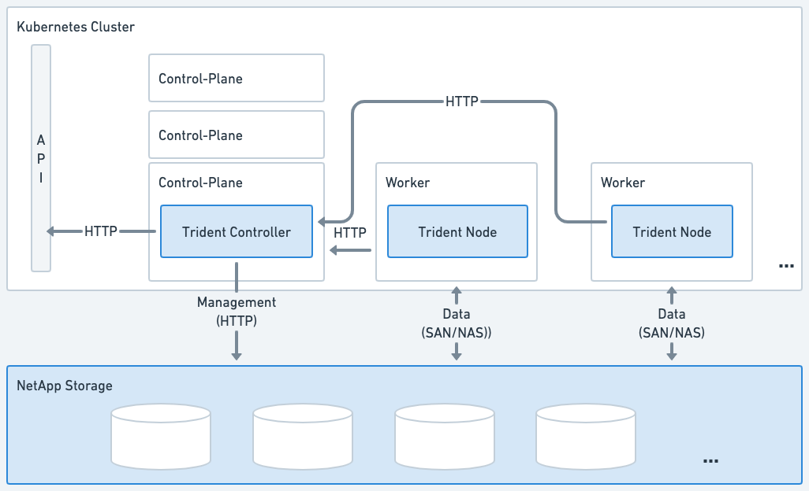
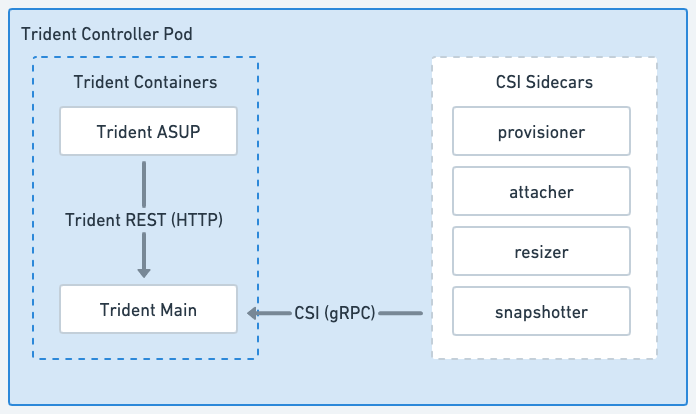
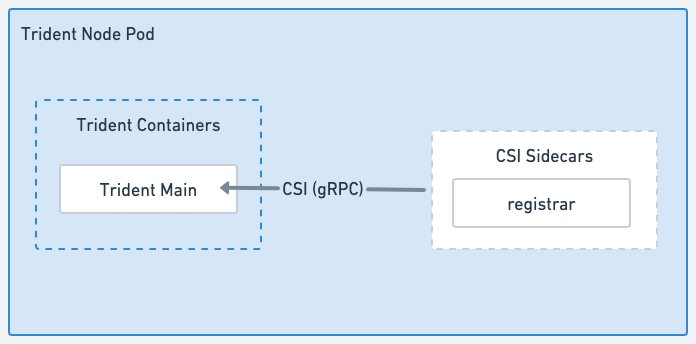

= Astra Trident架构
:hardbreaks:
:allow-uri-read: 
:icons: font
:imagesdir: ../media/

[role="lead"]
Asta三端存储作为一个控制器Pod和一个节点Pod运行在集群中的每个工作节点上。节点POD必须在任何可能要挂载Astra Trident卷的主机上运行。

== 了解控制器Pod和节点Pod

Asta三端到功能可作为一个整体部署 <<三项控制器Pod>> 以及一个或多个 <<三级节点块>> 在Kubernetes集群上、并使用标准Kubernetes _CSI Sidecar Containers_来简化CSI插件的部署。 link:https://kubernetes-csi.github.io/docs/sidecar-containers.html["Kubernetes CSI Sidecar Containers"^] 由Kubbernetes存储社区维护。

Kubernetes link:https://kubernetes.io/docs/concepts/scheduling-eviction/assign-pod-node/["节点选择器"^] 和 link:https://kubernetes.io/docs/concepts/scheduling-eviction/taint-and-toleration/["容忍和损害"^] 用于限制Pod在特定节点或首选节点上运行。您可以在Asta三端安装期间为控制器和节点Pod配置节点选择器和容差。

* 控制器插件负责卷配置和管理、例如快照和调整大小。
* 节点插件负责将存储连接到节点。

.Asta三端存储部署在Kubbernetes集群上

=== 三项控制器Pod

三端控制器Pod是一个运行CSI控制器插件的Pod。

* 负责配置和管理NetApp存储中的卷
* 由Kubbernetes部署管理
* 可以在控制面板或工作节点上运行、具体取决于安装参数。

.TRIdent控制器Pod示意图

=== 三级节点块

三端节点块是运行CSI节点插件的有权限的节点。

* 负责挂载和卸载主机上运行的Pos的存储
* 由Kubbernetes DemonSet管理
* 必须在要挂载NetApp存储的任何节点上运行

.TRIdent节点Pod图

== 支持的 Kubernetes 集群架构

以下 Kubernetes 架构支持 Astra Trident ：

[cols="3,1,2"]
|===
| Kubernetes 集群架构 | supported | 默认安装 

| 单个主节点，计算节点 | 是的。  a| 
是的。

| 多主机，计算 | 是的。  a| 
是的。

| 主， `etcd` ，计算 | 是的。  a| 
是的。

| 主机，基础架构，计算 | 是的。  a| 
是的。

|===