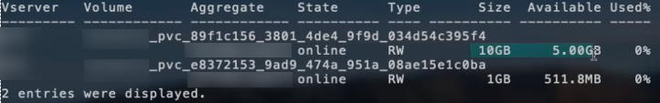

= 配置选项和示例
:hardbreaks:
:allow-uri-read: 
:icons: font
:imagesdir: ../media/

了解如何在您的 Astra Trident 安装中创建和使用 ONTAP NAS 驱动程序。本节提供了后端配置示例以及有关如何将后端映射到 StorageClasses 的详细信息。

== 后端配置选项

有关后端配置选项，请参见下表：

[cols="3"]
|===
| 参数 | Description | Default 

| `ve版本` |  | 始终为 1 

| `storageDriverName` | 存储驱动程序的名称 | "ontap-nas" ， "ontap-nas-economy-" ， "ontap-nas-flexgroup" ， "ontap-san " ， "ontap-san-economy-" 

| `backendName` | 自定义名称或存储后端 | 驱动程序名称 + "_" + dataLIF 

| `m年` 月 日 | 集群或 SVM 管理 LIF 的 IP 地址 | "10.0.0.1 " ， "2001 ： 1234 ： abcd ：：： fefe] " 

| `dataLIF` | 协议 LIF 的 IP 地址。对于 IPv6 ，请使用方括号。设置后无法更新 | 由 SVM 派生，除非另有说明 

| `autosExportPolicy` | 启用自动创建和更新导出策略 [ 布尔值 ] | false 

| `autosExportCIDR` | 启用 `AutoExportPolicy` 时用于筛选 Kubernetes 节点 IP 的 CIDR 列表 | [ "0.0.0.0/0 " ， " ：： /0 "]` 

| `标签` | 要应用于卷的一组任意 JSON 格式的标签 | " 

| `客户端证书` | 客户端证书的 Base64 编码值。用于基于证书的身份验证 | " 

| `clientPrivateKey` | 客户端专用密钥的 Base64 编码值。用于基于证书的身份验证 | " 

| `trustedCACertifate` | 受信任 CA 证书的 Base64 编码值。可选。用于基于证书的身份验证 | " 

| `用户名` | 用于连接到集群 /SVM 的用户名。用于基于凭据的身份验证 |  

| `密码` | 连接到集群 /SVM 的密码。用于基于凭据的身份验证 |  

| `sVM` | 要使用的 Storage Virtual Machine | 如果指定了 SVM `managementLIF` ，则派生 

| `igroupName` | 要使用的 SAN 卷的 igroup 的名称 | "trident — < 后端 UUID >" 

| `s存储前缀` | 在 SVM 中配置新卷时使用的前缀。设置后无法更新 | Trident 

| `limitAggregateUsage` | 如果使用量超过此百分比，则配置失败。* 不适用于适用于 ONTAP 的 Amazon FSx * | " （默认情况下不强制实施） 

| `limitVolumeSize` | 如果经济型驱动程序请求的卷大小超过此值，则配置失败。 | " （默认情况下不强制实施） 

| `lunsPerFlexvol` | 每个 FlexVol 的最大 LUN 数，必须在 50 ， 200 范围内 | 100 

| `debugTraceFlags` | 故障排除时要使用的调试标志。示例 ｛ "api" ： false ， "method " ： true ｝ | 空 

| `nfsMountOptions` | NFS 挂载选项的逗号分隔列表 | " 

| `qtreesPerFlexvol` | 每个 FlexVol 的最大 qtree 数，必须在 50 ， 300 范围内 | 200 

| `useREST` | 用于使用 ONTAP REST API 的布尔参数。* 技术预览 * | false 
|===

NOTE: `useREST` 提供了一个 * 技术预览 * ，建议用于测试环境，而不是生产工作负载。如果设置为 `true` ，则 Astra Trident 将使用 ONTAP REST API 与后端进行通信。此功能需要使用 ONTAP 9.9 及更高版本。此外，使用的 ONTAP 登录角色必须能够访问 `ONTAP` 应用程序。这一点可通过预定义的 `vsadmin` 和 `cluster-admin` 角色来满足。

要与 ONTAP 集群通信，您应提供身份验证参数。这可以是安全登录的用户名 / 密码，也可以是已安装的证书。

WARNING: 如果您使用适用于 NetApp ONTAP 后端的 Amazon FSX ，请勿指定 `limitAggregateUsage` 参数。Amazon FSX for NetApp ONTAP 提供的 `fsxadmin` 和 `vsadmin` 角色不包含检索聚合使用情况并通过 Astra Trident 对其进行限制所需的访问权限。

WARNING: 请勿使用 `debugTraceFlags` ，除非您正在进行故障排除并需要详细的日志转储。

NOTE: 创建后端时，请记住，创建后无法修改 `dataLIF` 和 `storagePrefix` 。要更新这些参数，您需要创建一个新的后端。

可以为 `managementLIF` 选项指定完全限定域名（ FQDN ）。也可以为 `dataLIF` 选项指定 FQDN ，在这种情况下， FQDN 将用于 NFS 挂载操作。这样，您就可以创建循环 DNS ，以便在多个数据 LIF 之间实现负载平衡。

对于所有 ONTAP 驱动程序，也可以将 `managementLIF` 设置为 IPv6 地址。请务必使用 ` -use-ipv6` 标志安装 Astra Trident 。必须 `m方括号内的` anagementLIF IPv6 地址。

WARNING: 使用 IPv6 地址时，请确保在方括号内定义 `managementLIF` 和 `dataLIF` （如果包含在后端定义中），例如 [28e8 ： d9fb ： a825 ： b7bf ： 69a8 ： d02f ： 9e7b ： 3555] 。如果未提供 `dataLIF` ，则 Astra Trident 将从 SVM 提取 IPv6 数据 LIF 。

使用 `autosExportPolicy` 和 `autosExportCIDR` 选项， CSI Trident 可以自动管理导出策略。所有 ontap-nas-* 驱动程序均支持此功能。

对于 `ontap-nas-economy` 驱动程序， `limitVolumeSize` 选项还会限制它为 qtree 和 FlexVol 管理的卷的最大大小，而 `qtreesPerFlexvol` 选项允许自定义每个 的最大 qtree 数。

可以使用 `nfsMountOptions` 参数指定挂载选项。Kubernetes 永久性卷的挂载选项通常在存储类中指定，但如果在存储类中未指定挂载选项，则 Astra Trident 将回退为使用存储后端配置文件中指定的挂载选项。如果在存储类或配置文件中未指定挂载选项，则 Astra Trident 不会在关联的永久性卷上设置任何挂载选项。

NOTE: Astra Trident 会在使用 `ontap-NAS` 和 `ontap-nas-flexgroup` 创建的所有卷的 "Comments" 字段中设置配置标签。根据所使用的驱动程序，注释将在 FlexVol （`ontap-NAS` ）或 FlexGroup （`ontap-nas-flexgroup` ）上进行设置。Astra Trident 会在配置存储池时将存储池上的所有标签复制到该存储卷。存储管理员可以为每个存储池定义标签，并对存储池中创建的所有卷进行分组。这样，您就可以根据后端配置中提供的一组可自定义标签来方便地区分卷了。

=== 用于配置卷的后端配置选项

您可以在配置的特殊部分中使用这些选项来控制默认配置每个卷的方式。有关示例，请参见以下配置示例。

[cols="3"]
|===
| 参数 | Description | Default 

| `spaceAllocation` | LUN 的空间分配 | true 

| `s页面预留` | 空间预留模式； " 无 " （精简）或 " 卷 " （厚） | 无 

| `sSnapshot 策略` | 要使用的 Snapshot 策略 | 无 

| `qosPolicy` | 要为创建的卷分配的 QoS 策略组。选择每个存储池 / 后端的 qosPolicy 或 adaptiveQosPolicy 之一 | " 

| `adaptiveQosPolicy` | 要为创建的卷分配的自适应 QoS 策略组。选择每个存储池 / 后端的 qosPolicy 或 adaptiveQosPolicy 之一。不受 ontap-nas-economy. | " 

| `sSnapshot 预留` | 为快照预留的卷百分比为 "0" | 如果 `snapshotPolicy` 为 " 无 " ，则为 " 无 " ，否则为 " " 

| `splitOnClone` | 创建克隆时，从其父级拆分该克隆 | false 

| `加密` | 启用 NetApp 卷加密 | false 

| `securityStyle` | 新卷的安全模式 | "unix" 

| `分层策略` | 使用 " 无 " 的分层策略 | 适用于 ONTAP 9.5 SVM-DR 之前的配置的 " 仅快照 " 

| unixPermissions | 新卷的模式 | 777. 

| snapshotDir | 控制 ` .snapshot` 目录的可见性 | false 

| 导出策略 | 要使用的导出策略 | default 

| securityStyle | 新卷的安全模式 | "unix" 
|===

NOTE: 在 Astra Trident 中使用 QoS 策略组需要 ONTAP 9.8 或更高版本。建议使用非共享 QoS 策略组，并确保策略组分别应用于每个成分卷。共享 QoS 策略组将对所有工作负载的总吞吐量实施上限。

下面是定义了默认值的示例：

[listing]
----
{
  "version": 1,
  "storageDriverName": "ontap-nas",
  "backendName": "customBackendName",
  "managementLIF": "10.0.0.1",
  "dataLIF": "10.0.0.2",
  "labels": {"k8scluster": "dev1", "backend": "dev1-nasbackend"},
  "svm": "trident_svm",
  "username": "cluster-admin",
  "password": "password",
  "limitAggregateUsage": "80%",
  "limitVolumeSize": "50Gi",
  "nfsMountOptions": "nfsvers=4",
  "debugTraceFlags": {"api":false, "method":true},
  "defaults": {
    "spaceReserve": "volume",
    "qosPolicy": "premium",
    "exportPolicy": "myk8scluster",
    "snapshotPolicy": "default",
    "snapshotReserve": "10"
  }
}
----
对于 `ontap-nas` 和 `ontap-nas-flexgroups` ， Astra Trident 现在使用新的计算方法来确保 FlexVol 的大小正确，并使用 snapshotReserve 百分比和 PVC 。当用户请求 PVC 时， Astra Trident 会使用新计算创建具有更多空间的原始 FlexVol 。此计算可确保用户在 PVC 中收到所请求的可写空间，而不是小于所请求的空间。在 v21.07 之前，如果用户请求 PVC （例如， 5GiB ），并且 snapshotReserve 为 50% ，则只会获得 2.5 GiB 的可写空间。这是因为用户请求的是整个卷，而 `snapshotReserve` 是其中的一个百分比。在 Trident 21.07 中，用户请求的是可写空间， Astra Trident 将 `snapshotReserve` number 定义为整个卷的百分比。这不适用于 `ontap-nas-economy"` 。请参见以下示例以了解其工作原理：

计算方法如下：

[listing]
----
Total volume size = (PVC requested size) / (1 - (snapshotReserve percentage) / 100)
----
对于 snapshotReserve = 50% ， PVC 请求 = 5GiB ，卷总大小为 2/.5 = 10GiB ，可用大小为 5GiB ，这是用户在 PVC 请求中请求的大小。`volume show` 命令应显示与以下示例类似的结果：

在升级 Astra Trident 时，先前安装的现有后端将按照上述说明配置卷。对于在升级之前创建的卷，您应调整其卷的大小，以便观察到所做的更改。例如，一个 2 GiB PVC ，其 `snapshotReserve=50` earlier 会导致一个卷提供 1 GiB 的可写空间。例如，将卷大小调整为 3GiB 可为应用程序在一个 6 GiB 卷上提供 3GiB 的可写空间。

== 最低配置示例

以下示例显示了将大多数参数保留为默认值的基本配置。这是定义后端的最简单方法。

NOTE: 如果在采用 Trident 的 NetApp ONTAP 上使用 Amazon FSx ，建议为 LIF 指定 DNS 名称，而不是 IP 地址。

=== 具有基于证书的身份验证的 ONTAP NAS 驱动程序

这是一个最低后端配置示例。`clientCertificate` ， `clientPrivateKey` 和 `trustedCACertifate` （如果使用可信 CA ，则可选）分别填充在 `backend.json` 中，并采用客户端证书，私钥和可信 CA 证书的 base64 编码值。

[listing]
----
{
  "version": 1,
  "backendName": "DefaultNASBackend",
  "storageDriverName": "ontap-nas",
  "managementLIF": "10.0.0.1",
  "dataLIF": "10.0.0.15",
  "svm": "nfs_svm",
  "clientCertificate": "ZXR0ZXJwYXB...ICMgJ3BhcGVyc2",
  "clientPrivateKey": "vciwKIyAgZG...0cnksIGRlc2NyaX",
  "trustedCACertificate": "zcyBbaG...b3Igb3duIGNsYXNz",
  "storagePrefix": "myPrefix_"
}
----

=== 具有自动导出策略的 ontap-NAS 驱动程序

此示例显示了如何指示 Astra Trident 使用动态导出策略自动创建和管理导出策略。这对于 `ontap-nas-economy.` 和 `ontap-nas-flexgroup` 驱动程序也是如此。

[listing]
----
{
    "version": 1,
    "storageDriverName": "ontap-nas",
    "managementLIF": "10.0.0.1",
    "dataLIF": "10.0.0.2",
    "svm": "svm_nfs",
    "labels": {"k8scluster": "test-cluster-east-1a", "backend": "test1-nasbackend"},
    "autoExportPolicy": true,
    "autoExportCIDRs": ["10.0.0.0/24"],
    "username": "admin",
    "password": "secret",
    "nfsMountOptions": "nfsvers=4",
}
----

=== ontap-nas-flexgroup 驱动程序

[listing]
----
{
    "version": 1,
    "storageDriverName": "ontap-nas-flexgroup",
    "managementLIF": "10.0.0.1",
    "dataLIF": "10.0.0.2",
    "labels": {"k8scluster": "test-cluster-east-1b", "backend": "test1-ontap-cluster"},
    "svm": "svm_nfs",
    "username": "vsadmin",
    "password": "secret",
}
----

=== 使用 IPv6 的 ONTAP NAS 驱动程序

[listing]
----
{
 "version": 1,
 "storageDriverName": "ontap-nas",
 "backendName": "nas_ipv6_backend",
 "managementLIF": "[5c5d:5edf:8f:7657:bef8:109b:1b41:d491]",
 "labels": {"k8scluster": "test-cluster-east-1a", "backend": "test1-ontap-ipv6"},
 "svm": "nas_ipv6_svm",
 "username": "vsadmin",
 "password": "netapp123"
}
----

=== ontap-nas-economy-driver

[listing]
----
{
    "version": 1,
    "storageDriverName": "ontap-nas-economy",
    "managementLIF": "10.0.0.1",
    "dataLIF": "10.0.0.2",
    "svm": "svm_nfs",
    "username": "vsadmin",
    "password": "secret"
}
----

== 虚拟存储池后端示例

在下面显示的示例后端定义文件中，会为所有存储池设置特定的默认值，例如 `spaceReserve` at none ， `spaceAllocation` at false 和 `encryption` at false 。虚拟存储池在存储部分中进行定义。

在此示例中，某些存储池会设置自己的 `spaceReserve` ， `spaceAllocation` 和 `encryption` 值，而某些池会覆盖上述设置的默认值。

=== ontap-NAS 驱动程序

[listing]
----
{
    {
    "version": 1,
    "storageDriverName": "ontap-nas",
    "managementLIF": "10.0.0.1",
    "dataLIF": "10.0.0.2",
    "svm": "svm_nfs",
    "username": "admin",
    "password": "secret",
    "nfsMountOptions": "nfsvers=4",

    "defaults": {
          "spaceReserve": "none",
          "encryption": "false",
          "qosPolicy": "standard"
    },
    "labels":{"store":"nas_store", "k8scluster": "prod-cluster-1"},
    "region": "us_east_1",
    "storage": [
        {
            "labels":{"app":"msoffice", "cost":"100"},
            "zone":"us_east_1a",
            "defaults": {
                "spaceReserve": "volume",
                "encryption": "true",
                "unixPermissions": "0755",
                "adaptiveQosPolicy": "adaptive-premium"
            }
        },
        {
            "labels":{"app":"slack", "cost":"75"},
            "zone":"us_east_1b",
            "defaults": {
                "spaceReserve": "none",
                "encryption": "true",
                "unixPermissions": "0755"
            }
        },
        {
            "labels":{"app":"wordpress", "cost":"50"},
            "zone":"us_east_1c",
            "defaults": {
                "spaceReserve": "none",
                "encryption": "true",
                "unixPermissions": "0775"
            }
        },
        {
            "labels":{"app":"mysqldb", "cost":"25"},
            "zone":"us_east_1d",
            "defaults": {
                "spaceReserve": "volume",
                "encryption": "false",
                "unixPermissions": "0775"
            }
        }
    ]
}
----

=== ontap-nas-flexgroup 驱动程序

[listing]
----
{
    "version": 1,
    "storageDriverName": "ontap-nas-flexgroup",
    "managementLIF": "10.0.0.1",
    "dataLIF": "10.0.0.2",
    "svm": "svm_nfs",
    "username": "vsadmin",
    "password": "secret",

    "defaults": {
          "spaceReserve": "none",
          "encryption": "false"
    },
    "labels":{"store":"flexgroup_store", "k8scluster": "prod-cluster-1"},
    "region": "us_east_1",
    "storage": [
        {
            "labels":{"protection":"gold", "creditpoints":"50000"},
            "zone":"us_east_1a",
            "defaults": {
                "spaceReserve": "volume",
                "encryption": "true",
                "unixPermissions": "0755"
            }
        },
        {
            "labels":{"protection":"gold", "creditpoints":"30000"},
            "zone":"us_east_1b",
            "defaults": {
                "spaceReserve": "none",
                "encryption": "true",
                "unixPermissions": "0755"
            }
        },
        {
            "labels":{"protection":"silver", "creditpoints":"20000"},
            "zone":"us_east_1c",
            "defaults": {
                "spaceReserve": "none",
                "encryption": "true",
                "unixPermissions": "0775"
            }
        },
        {
            "labels":{"protection":"bronze", "creditpoints":"10000"},
            "zone":"us_east_1d",
            "defaults": {
                "spaceReserve": "volume",
                "encryption": "false",
                "unixPermissions": "0775"
            }
        }
    ]
}
----

=== ontap-nas-economy-driver

[listing]
----
{
    "version": 1,
    "storageDriverName": "ontap-nas-economy",
    "managementLIF": "10.0.0.1",
    "dataLIF": "10.0.0.2",
    "svm": "svm_nfs",
    "username": "vsadmin",
    "password": "secret",

    "defaults": {
          "spaceReserve": "none",
          "encryption": "false"
    },
    "labels":{"store":"nas_economy_store"},
    "region": "us_east_1",
    "storage": [
        {
            "labels":{"department":"finance", "creditpoints":"6000"},
            "zone":"us_east_1a",
            "defaults": {
                "spaceReserve": "volume",
                "encryption": "true",
                "unixPermissions": "0755"
            }
        },
        {
            "labels":{"department":"legal", "creditpoints":"5000"},
            "zone":"us_east_1b",
            "defaults": {
                "spaceReserve": "none",
                "encryption": "true",
                "unixPermissions": "0755"
            }
        },
        {
            "labels":{"department":"engineering", "creditpoints":"3000"},
            "zone":"us_east_1c",
            "defaults": {
                "spaceReserve": "none",
                "encryption": "true",
                "unixPermissions": "0775"
            }
        },
        {
            "labels":{"department":"humanresource", "creditpoints":"2000"},
            "zone":"us_east_1d",
            "defaults": {
                "spaceReserve": "volume",
                "encryption": "false",
                "unixPermissions": "0775"
            }
        }
    ]
}
----

== 将后端映射到 StorageClasses

以下 StorageClass 定义引用了上述虚拟存储池。使用 `parameters.selector` 字段，每个 StorageClass 都会调用可用于托管卷的虚拟池。卷将在选定虚拟池中定义各个方面。

* 第一个 StorageClass （`protection-gold` ）将映射到 `ontap-nas-flexgroup` 后端的第一个，第二个虚拟存储池以及 `ontap-san` 后端的第一个虚拟存储池。这是唯一一个提供黄金级保护的池。
* 第二个 StorageClass （`protection-not-gold` ）将映射到 `ontap-nas-flexgroup` 后端的第三个，第四个虚拟存储池以及 `ontap-san` 后端的第二个，第三个虚拟存储池。这些池是唯一提供黄金级以外保护级别的池。
* 第三个 StorageClass （`app-mysqldb` ）将映射到 `ontap-NAS` 后端的第四个虚拟存储池和 `ontap-san-economy-backend` 的第三个虚拟存储池。这些池是唯一为 mysqldb 类型的应用程序提供存储池配置的池。
* 第四个存储类（`protection-silver-creditpoins-20k` ）将映射到 `ontap-nas-flexgroup` 后端的第三个虚拟存储池和 `ontap-san` 后端的第二个虚拟存储池。这些池是唯一以 20000 个信用点提供黄金级保护的池。
* 第五个存储类（`credits-5k` ）将映射到 `ontap-nas-economy-backend` 中的第二个虚拟存储池和 `ontap-san` 后端的第三个虚拟存储池。这些是唯一一款具有 5000 个信用点的池产品。

Astra Trident 将决定选择哪个虚拟存储池，并确保满足存储要求。

[listing]
----
apiVersion: storage.k8s.io/v1
kind: StorageClass
metadata:
  name: protection-gold
provisioner: netapp.io/trident
parameters:
  selector: "protection=gold"
  fsType: "ext4"
---
apiVersion: storage.k8s.io/v1
kind: StorageClass
metadata:
  name: protection-not-gold
provisioner: netapp.io/trident
parameters:
  selector: "protection!=gold"
  fsType: "ext4"
---
apiVersion: storage.k8s.io/v1
kind: StorageClass
metadata:
  name: app-mysqldb
provisioner: netapp.io/trident
parameters:
  selector: "app=mysqldb"
  fsType: "ext4"
---
apiVersion: storage.k8s.io/v1
kind: StorageClass
metadata:
  name: protection-silver-creditpoints-20k
provisioner: netapp.io/trident
parameters:
  selector: "protection=silver; creditpoints=20000"
  fsType: "ext4"
---
apiVersion: storage.k8s.io/v1
kind: StorageClass
metadata:
  name: creditpoints-5k
provisioner: netapp.io/trident
parameters:
  selector: "creditpoints=5000"
  fsType: "ext4"
----