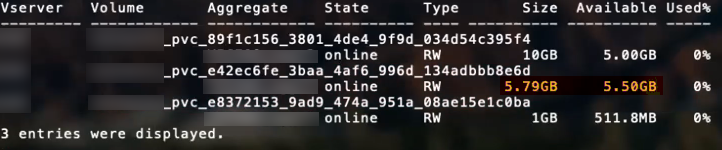

= 配置选项和示例
:hardbreaks:
:allow-uri-read: 
:icons: font
:imagesdir: ../media/

了解如何在您的 Astra Trident 安装中创建和使用 ONTAP SAN 驱动程序。本节提供了后端配置示例以及有关如何将后端映射到 StorageClasses 的详细信息。

== 后端配置选项

有关后端配置选项，请参见下表：

[cols="3"]
|===
| 参数 | Description | Default 

| `ve版本` |  | 始终为 1 

| `storageDriverName` | 存储驱动程序的名称 | "ontap-nas" ， "ontap-nas-economy-" ， "ontap-nas-flexgroup" ， "ontap-san " ， "ontap-san-economy-" 

| `backendName` | 自定义名称或存储后端 | 驱动程序名称 + "_" + dataLIF 

| `m年` 月 日 | 集群或 SVM 管理 LIF 的 IP 地址 | "10.0.0.1 " ， "2001 ： 1234 ： abcd ：：： fefe] " 

| `dataLIF` | 协议 LIF 的 IP 地址。对于 IPv6 ，请使用方括号。设置后无法更新 | 由 SVM 派生，除非另有说明 

| `使用 CHAP` | 使用 CHAP 对 iSCSI 的 ONTAP SAN 驱动程序进行身份验证 [ 布尔值 ] | false 

| `chapInitiatorSecret` | CHAP 启动程序密钥。如果为 `useCHAP=true` ，则为必需项 | " 

| `标签` | 要应用于卷的一组任意 JSON 格式的标签 | " 

| `chapTargetInitiatorSecret` | CHAP 目标启动程序密钥。如果为 `useCHAP=true` ，则为必需项 | " 

| `chapUsername` | 入站用户名。如果为 `useCHAP=true` ，则为必需项 | " 

| `chapTargetUsername` | 目标用户名。如果为 `useCHAP=true` ，则为必需项 | " 

| `客户端证书` | 客户端证书的 Base64 编码值。用于基于证书的身份验证 | " 

| `clientPrivateKey` | 客户端专用密钥的 Base64 编码值。用于基于证书的身份验证 | " 

| `trustedCACertifate` | 受信任 CA 证书的 Base64 编码值。可选。用于基于证书的身份验证 | " 

| `用户名` | 用于连接到集群 /SVM 的用户名。用于基于凭据的身份验证 | " 

| `密码` | 连接到集群 /SVM 的密码。用于基于凭据的身份验证 | " 

| `sVM` | 要使用的 Storage Virtual Machine | 如果指定了 SVM `managementLIF` ，则派生 

| `igroupName` | 要使用的 SAN 卷的 igroup 的名称 | "trident — < 后端 UUID >" 

| `s存储前缀` | 在 SVM 中配置新卷时使用的前缀。设置后无法更新 | Trident 

| `limitAggregateUsage` | 如果使用量超过此百分比，则配置失败。* 不适用于适用于 ONTAP 的 Amazon FSx * | " （默认情况下不强制实施） 

| `limitVolumeSize` | 如果经济型驱动程序请求的卷大小超过此值，则配置失败。 | " （默认情况下不强制实施） 

| `lunsPerFlexvol` | 每个 FlexVol 的最大 LUN 数，必须在 50 ， 200 范围内 | 100 

| `debugTraceFlags` | 故障排除时要使用的调试标志。示例 ｛ "api" ： false ， "method " ： true ｝ | 空 

| `useREST` | 用于使用 ONTAP REST API 的布尔参数。* 技术预览 * | false 
|===

NOTE: `useREST` 提供了一个 * 技术预览 * ，建议用于测试环境，而不是生产工作负载。如果设置为 `true` ，则 Astra Trident 将使用 ONTAP REST API 与后端进行通信。此功能需要使用 ONTAP 9.9 及更高版本。此外，使用的 ONTAP 登录角色必须能够访问 `ONTAP` 应用程序。这一点可通过预定义的 `vsadmin` 和 `cluster-admin` 角色来满足。

要与 ONTAP 集群通信，您应提供身份验证参数。这可以是安全登录的用户名 / 密码，也可以是已安装的证书。

WARNING: 如果您使用适用于 NetApp ONTAP 后端的 Amazon FSX ，请勿指定 `limitAggregateUsage` 参数。Amazon FSX for NetApp ONTAP 提供的 `fsxadmin` 和 `vsadmin` 角色不包含检索聚合使用情况并通过 Astra Trident 对其进行限制所需的访问权限。

WARNING: 请勿使用 `debugTraceFlags` ，除非您正在进行故障排除并需要详细的日志转储。

对于 `ontap-san` 驱动程序，默认使用 SVM 中的所有数据 LIF IP 并使用 iSCSI 多路径。为 `ontap-san` 驱动程序的 dataLIF 指定 IP 地址会强制其禁用多路径并仅使用指定的地址。

NOTE: 创建后端时，请记住，创建后无法修改 `dataLIF` 和 `storagePrefix` 。要更新这些参数，您需要创建一个新的后端。

可以将 `igroupName` 设置为已在 ONTAP 集群上创建的 igroup 。如果未指定，则 Astra Trident 会自动创建一个名为 trident -<backender-UUUUUID> 的 igroup 。如果要在环境之间共享 SVM ，则如果提供预定义的 igroupName ， NetApp 建议为每个 Kubernetes 集群使用一个 igroup 。这对于 Astra Trident 自动保持 IQN 添加 / 删除是必需的。

后端也可以在创建后更新 igroup ：

* 可以更新 igroupName 以指向在 Astra Trident 之外的 SVM 上创建和管理的新 igroup 。
* 可以省略 igroupName 。在这种情况下， Astra Trident 将自动创建和管理 trident -<backend-UUUUID> igroup 。

在这两种情况下，仍可访问卷附件。未来的卷附件将使用更新后的 igroup 。此更新不会中断对后端卷的访问。

可以为 `managementLIF` 选项指定完全限定域名（ FQDN ）。

对于所有 ONTAP 驱动程序，也可以将 `managementLIF` 设置为 IPv6 地址。请务必使用 ` -use-ipv6` 标志安装 Trident 。必须注意在方括号内定义 `managementLIF` IPv6 地址。

WARNING: 使用 IPv6 地址时，请确保在方括号内定义 `managementLIF` 和 `dataLIF` （如果包含在后端定义中），例如 [28e8 ： d9fb ： a825 ： b7bf ： 69a8 ： d02f ： 9e7b ： 3555] 。如果未提供 `dataLIF` ，则 Astra Trident 将从 SVM 提取 IPv6 数据 LIF 。

要使 ontap-san 驱动程序能够使用 CHAP ，请在后端定义中将 `useCHAP` 参数设置为 `true` 。然后， Astra Trident 将配置双向 CHAP 并将其用作后端给定 SVM 的默认身份验证。请参见 link:ontap-san-prep.html["此处"^] 了解其工作原理。

对于 `ontap-san-economi` 驱动程序， `limitVolumeSize` 选项还会限制它为 qtree 和 LUN 管理的卷的最大大小。

NOTE: Astra Trident 会在使用 `ontap-san` 驱动程序创建的所有卷的 "Comments" 字段中设置配置标签。对于创建的每个卷， FlexVol 上的 "Comments" 字段将使用其所在存储池上的所有标签填充。存储管理员可以为每个存储池定义标签，并对存储池中创建的所有卷进行分组。这样，您就可以根据后端配置中提供的一组可自定义标签来方便地区分卷了。

=== 用于配置卷的后端配置选项

您可以在配置的特殊部分中使用这些选项来控制默认配置每个卷的方式。有关示例，请参见以下配置示例。

[cols="3"]
|===
| 参数 | Description | Default 

| `spaceAllocation` | LUN 的空间分配 | true 

| `s页面预留` | 空间预留模式； " 无 " （精简）或 " 卷 " （厚） | 无 

| `sSnapshot 策略` | 要使用的 Snapshot 策略 | 无 

| `qosPolicy` | 要为创建的卷分配的 QoS 策略组。选择每个存储池 / 后端的 qosPolicy 或 adaptiveQosPolicy 之一 | " 

| `adaptiveQosPolicy` | 要为创建的卷分配的自适应 QoS 策略组。选择每个存储池 / 后端的 qosPolicy 或 adaptiveQosPolicy 之一 | " 

| `sSnapshot 预留` | 为快照预留的卷百分比为 "0" | 如果 `snapshotPolicy` 为 " 无 " ，则为 " 无 " ，否则为 " " 

| `splitOnClone` | 创建克隆时，从其父级拆分该克隆 | false 

| `splitOnClone` | 创建克隆时，从其父级拆分该克隆 | false 

| `加密` | 启用 NetApp 卷加密 | false 

| `securityStyle` | 新卷的安全模式 | "unix" 

| `分层策略` | 使用 " 无 " 的分层策略 | 适用于 ONTAP 9.5 SVM-DR 之前的配置的 " 仅快照 " 
|===

NOTE: 在 Astra Trident 中使用 QoS 策略组需要 ONTAP 9.8 或更高版本。建议使用非共享 QoS 策略组，并确保策略组分别应用于每个成分卷。共享 QoS 策略组将对所有工作负载的总吞吐量实施上限。

下面是定义了默认值的示例：

[listing]
----
{
 "version": 1,
 "storageDriverName": "ontap-san",
 "managementLIF": "10.0.0.1",
 "dataLIF": "10.0.0.2",
 "svm": "trident_svm",
 "username": "admin",
 "password": "password",
 "labels": {"k8scluster": "dev2", "backend": "dev2-sanbackend"},
 "storagePrefix": "alternate-trident",
 "igroupName": "custom",
 "debugTraceFlags": {"api":false, "method":true},
 "defaults": {
     "spaceReserve": "volume",
     "qosPolicy": "standard",
     "spaceAllocation": "false",
     "snapshotPolicy": "default",
     "snapshotReserve": "10"
 }
}
----

NOTE: 对于使用 `ontap-san` 驱动程序创建的所有卷， Astra Trident 会向 FlexVol 额外添加 10% 的容量，以容纳 LUN 元数据。LUN 将使用用户在 PVC 中请求的确切大小进行配置。Astra Trident 将 FlexVol 增加 10% （在 ONTAP 中显示为可用大小）。用户现在将获得所请求的可用容量。此更改还可防止 LUN 变为只读状态，除非已充分利用可用空间。这不适用于 ontap-san-economy.

对于定义 `snapshotReserve` 的后端， Astra Trident 将按如下方式计算卷的大小：

[listing]
----
Total volume size = [(PVC requested size) / (1 - (snapshotReserve percentage) / 100)] * 1.1
----
1.1 是 Astra Trident 向 FlexVol 额外添加 10% 以容纳 LUN 元数据。对于 `snapshotReserve` = 5% ， PVC 请求 = 5GiB ，卷总大小为 5.79GiB ，可用大小为 5.5GiB 。`volume show` 命令应显示与以下示例类似的结果：

目前，调整大小是对现有卷使用新计算的唯一方法。

== 最低配置示例

以下示例显示了将大多数参数保留为默认值的基本配置。这是定义后端的最简单方法。

NOTE: 如果您正在将 NetApp ONTAP 上的 Amazon FSx 与 Astra Trident 结合使用，建议为 LIF 指定 DNS 名称，而不是 IP 地址。

=== 具有基于证书的身份验证的 ontap-san 驱动程序

这是一个最低后端配置示例。`clientCertificate` ， `clientPrivateKey` 和 `trustedCACertifate` （如果使用可信 CA ，则可选）分别填充在 `backend.json` 中，并采用客户端证书，私钥和可信 CA 证书的 base64 编码值。

[listing]
----
{
    "version": 1,
    "storageDriverName": "ontap-san",
    "backendName": "DefaultSANBackend",
    "managementLIF": "10.0.0.1",
    "dataLIF": "10.0.0.3",
    "svm": "svm_iscsi",
    "useCHAP": true,
    "chapInitiatorSecret": "cl9qxIm36DKyawxy",
    "chapTargetInitiatorSecret": "rqxigXgkesIpwxyz",
    "chapTargetUsername": "iJF4heBRT0TCwxyz",
    "chapUsername": "uh2aNCLSd6cNwxyz",
    "igroupName": "trident",
    "clientCertificate": "ZXR0ZXJwYXB...ICMgJ3BhcGVyc2",
    "clientPrivateKey": "vciwKIyAgZG...0cnksIGRlc2NyaX",
    "trustedCACertificate": "zcyBbaG...b3Igb3duIGNsYXNz"
}
----

=== 具有双向 CHAP 的 ONTAP SAN 驱动程序

这是一个最低后端配置示例。此基本配置将创建一个 `ontap-san` 后端，并将 `useCHAP` 设置为 `true` 。

[listing]
----
{
    "version": 1,
    "storageDriverName": "ontap-san",
    "managementLIF": "10.0.0.1",
    "dataLIF": "10.0.0.3",
    "svm": "svm_iscsi",
    "labels": {"k8scluster": "test-cluster-1", "backend": "testcluster1-sanbackend"},
    "useCHAP": true,
    "chapInitiatorSecret": "cl9qxIm36DKyawxy",
    "chapTargetInitiatorSecret": "rqxigXgkesIpwxyz",
    "chapTargetUsername": "iJF4heBRT0TCwxyz",
    "chapUsername": "uh2aNCLSd6cNwxyz",
    "igroupName": "trident",
    "username": "vsadmin",
    "password": "secret"
}
----

=== ontap-san-economy-driver

[listing]
----
{
    "version": 1,
    "storageDriverName": "ontap-san-economy",
    "managementLIF": "10.0.0.1",
    "svm": "svm_iscsi_eco",
    "useCHAP": true,
    "chapInitiatorSecret": "cl9qxIm36DKyawxy",
    "chapTargetInitiatorSecret": "rqxigXgkesIpwxyz",
    "chapTargetUsername": "iJF4heBRT0TCwxyz",
    "chapUsername": "uh2aNCLSd6cNwxyz",
    "igroupName": "trident",
    "username": "vsadmin",
    "password": "secret"
}
----

== 虚拟存储池后端示例

在下面显示的示例后端定义文件中，会为所有存储池设置特定的默认值，例如 `spaceReserve` at none ， `spaceAllocation` at false 和 `encryption` at false 。虚拟存储池在存储部分中进行定义。

在此示例中，某些存储池会设置自己的 `spaceReserve` ， `spaceAllocation` 和 `encryption` 值，而某些池会覆盖上述设置的默认值。

[listing]
----
{
    "version": 1,
    "storageDriverName": "ontap-san",
    "managementLIF": "10.0.0.1",
    "dataLIF": "10.0.0.3",
    "svm": "svm_iscsi",
    "useCHAP": true,
    "chapInitiatorSecret": "cl9qxIm36DKyawxy",
    "chapTargetInitiatorSecret": "rqxigXgkesIpwxyz",
    "chapTargetUsername": "iJF4heBRT0TCwxyz",
    "chapUsername": "uh2aNCLSd6cNwxyz",
    "igroupName": "trident",
    "username": "vsadmin",
    "password": "secret",

    "defaults": {
          "spaceAllocation": "false",
          "encryption": "false",
          "qosPolicy": "standard"
    },
    "labels":{"store": "san_store", "kubernetes-cluster": "prod-cluster-1"},
    "region": "us_east_1",
    "storage": [
        {
            "labels":{"protection":"gold", "creditpoints":"40000"},
            "zone":"us_east_1a",
            "defaults": {
                "spaceAllocation": "true",
                "encryption": "true",
                "adaptiveQosPolicy": "adaptive-extreme"
            }
        },
        {
            "labels":{"protection":"silver", "creditpoints":"20000"},
            "zone":"us_east_1b",
            "defaults": {
                "spaceAllocation": "false",
                "encryption": "true",
                "qosPolicy": "premium"
            }
        },
        {
            "labels":{"protection":"bronze", "creditpoints":"5000"},
            "zone":"us_east_1c",
            "defaults": {
                "spaceAllocation": "true",
                "encryption": "false"
            }
        }
    ]
}
----
以下是 `ontap-san-economy-经济` 驱动程序的 iSCSI 示例：

[listing]
----
{
    "version": 1,
    "storageDriverName": "ontap-san-economy",
    "managementLIF": "10.0.0.1",
    "svm": "svm_iscsi_eco",
    "useCHAP": true,
    "chapInitiatorSecret": "cl9qxIm36DKyawxy",
    "chapTargetInitiatorSecret": "rqxigXgkesIpwxyz",
    "chapTargetUsername": "iJF4heBRT0TCwxyz",
    "chapUsername": "uh2aNCLSd6cNwxyz",
    "igroupName": "trident",
    "username": "vsadmin",
    "password": "secret",

    "defaults": {
          "spaceAllocation": "false",
          "encryption": "false"
    },
    "labels":{"store":"san_economy_store"},
    "region": "us_east_1",
    "storage": [
        {
            "labels":{"app":"oracledb", "cost":"30"},
            "zone":"us_east_1a",
            "defaults": {
                "spaceAllocation": "true",
                "encryption": "true"
            }
        },
        {
            "labels":{"app":"postgresdb", "cost":"20"},
            "zone":"us_east_1b",
            "defaults": {
                "spaceAllocation": "false",
                "encryption": "true"
            }
        },
        {
            "labels":{"app":"mysqldb", "cost":"10"},
            "zone":"us_east_1c",
            "defaults": {
                "spaceAllocation": "true",
                "encryption": "false"
            }
        }
    ]
}
----

== 将后端映射到 StorageClasses

以下 StorageClass 定义引用了上述虚拟存储池。使用 `parameters.selector` 字段，每个 StorageClass 都会调用可用于托管卷的虚拟池。卷将在选定虚拟池中定义各个方面。

* 第一个 StorageClass （`protection-gold` ）将映射到 `ontap-nas-flexgroup` 后端的第一个，第二个虚拟存储池以及 `ontap-san` 后端的第一个虚拟存储池。这是唯一一个提供黄金级保护的池。
* 第二个 StorageClass （`protection-not-gold` ）将映射到 `ontap-nas-flexgroup` 后端的第三个，第四个虚拟存储池以及 `ontap-san` 后端的第二个，第三个虚拟存储池。这些池是唯一提供黄金级以外保护级别的池。
* 第三个 StorageClass （`app-mysqldb` ）将映射到 `ontap-NAS` 后端的第四个虚拟存储池和 `ontap-san-economy-backend` 的第三个虚拟存储池。这些池是唯一为 mysqldb 类型的应用程序提供存储池配置的池。
* 第四个存储类（`protection-silver-creditpoins-20k` ）将映射到 `ontap-nas-flexgroup` 后端的第三个虚拟存储池和 `ontap-san` 后端的第二个虚拟存储池。这些池是唯一以 20000 个信用点提供黄金级保护的池。
* 第五个存储类（`credits-5k` ）将映射到 `ontap-nas-economy-backend` 中的第二个虚拟存储池和 `ontap-san` 后端的第三个虚拟存储池。这些是唯一一款具有 5000 个信用点的池产品。

Astra Trident 将决定选择哪个虚拟存储池，并确保满足存储要求。

[listing]
----
apiVersion: storage.k8s.io/v1
kind: StorageClass
metadata:
  name: protection-gold
provisioner: netapp.io/trident
parameters:
  selector: "protection=gold"
  fsType: "ext4"
---
apiVersion: storage.k8s.io/v1
kind: StorageClass
metadata:
  name: protection-not-gold
provisioner: netapp.io/trident
parameters:
  selector: "protection!=gold"
  fsType: "ext4"
---
apiVersion: storage.k8s.io/v1
kind: StorageClass
metadata:
  name: app-mysqldb
provisioner: netapp.io/trident
parameters:
  selector: "app=mysqldb"
  fsType: "ext4"
---
apiVersion: storage.k8s.io/v1
kind: StorageClass
metadata:
  name: protection-silver-creditpoints-20k
provisioner: netapp.io/trident
parameters:
  selector: "protection=silver; creditpoints=20000"
  fsType: "ext4"
---
apiVersion: storage.k8s.io/v1
kind: StorageClass
metadata:
  name: creditpoints-5k
provisioner: netapp.io/trident
parameters:
  selector: "creditpoints=5000"
  fsType: "ext4"
----